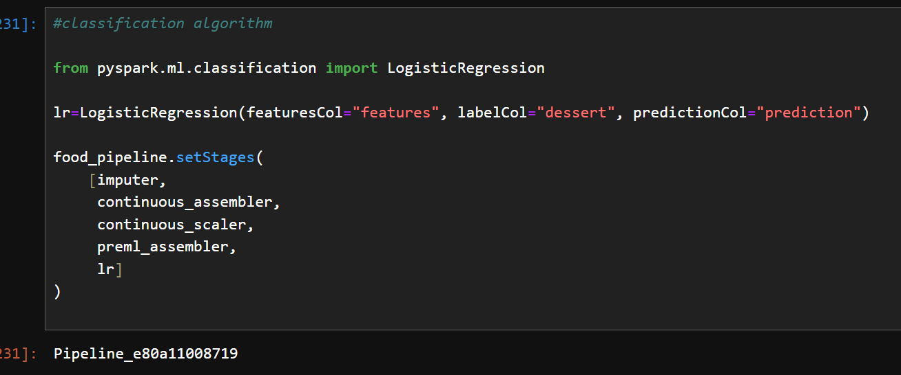

# Machine Learning Pipeline using Spark

I made a logistic regression classifier that classifies whether the dish is a dessert or not.

I used PySpark to make the ML pipeline.

## Transformers and Estimators

The pipeline has transformers and estimators.

## Data cleanup

- Read a CSV file containing dish names and multiple columns as feauture candidates.
- Sanitized the column names (lowered the case and fixed the punctuation, spacing, and nonprintable characters).
- Removed illogical and irrelevant records.
- Filled the null values of binary columns to 0.0.
- Capped the amounts for calories, protein, fat, and sodium to the 99th percentile.
- Created ratio features (number of calores from a macro over number of calories for the dish).
- Imputed the mean of continuous features.
- Scaled continuous features between 0 and 1.0.

## ROC Curve Results

The area under the ROC Curve is the next one:

