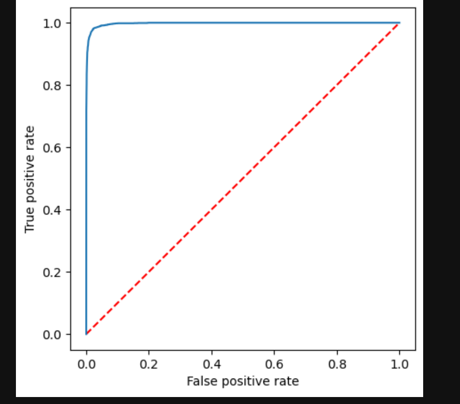

# Machine Learning Pipeline using Spark

I made a machine learning pipeline using pyspark MLLib.
I made Data cleanup with pyspark SQL.

## Custom Transformers and Estimators

- I made a custom transformer that fills NA values with a value from the user.
- I made a custom estimator that caps extreme values in a column.
  The custom estimator has the estimator a model and a mixin.

Both are in the pipeline notebook.

## Data cleanup

- Read a CSV file containing dish names and multiple columns as feauture candidates.
- Sanitized the column names (lowered the case and fixed the punctuation, spacing, and nonprintable characters).
- Removed illogical and irrelevant records.
- Filled the null values of binary columns to 0.0. CUSTOM
- Capped the amounts for calories, protein, fat, and sodium. CUSTOM
- Created ratio features (number of calores from a macro over number of calories for the dish).
- Imputed the mean of continuous features.
- Scaled continuous features between 0 and 1.0.

## ML PIPELINE

I also used estimators and transformers from spark. I used the logistic regression classifier that classifies whether the dish is a dessert or not.

If you want to look at the pipeline look at pipeline notebook.

## ROC Curve Results

The area under the ROC Curve is the next one:

